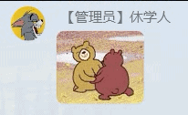

## Hello from Docusaurus

Are you ready to create the documentation site for your open source project?

To find more details about this markdown, check [here](https://v2.docusaurus.io/docs/markdown-features).

To find more about versioning, check [here](https://v2.docusaurus.io/docs/versioning).

### Headers

will show up on the table of contents on the upper right

So that your users will know what this page is all about without scrolling down or even without reading too much.

### Only h2 and h3 will be in the toc

Other levels will not.

## Writing MDX

The headers are well-spaced so that the hierarchy is clear.

- lists will help you
- present the key points
- that you want your users to remember
  - and you may nest them
    - multiple times

export const Highlight = ({children, color}) => (
  <span
    style={{
      backgroundColor: color,
      borderRadius: '2px',
      color: '#fff',
      padding: '0.2rem',
    }}>
    {children}
  </span>
);

<Highlight color="#25c2a0">Docusaurus green</Highlight> and <Highlight color="#1877F2">Facebook blue</Highlight> are my favorite colors.

I can write **Markdown** alongside my _JSX_!

## Tabs

import Tabs from '@theme/Tabs';
import TabItem from '@theme/TabItem';


<Tabs
    defaultValue="apple"
    values={[
        {label: 'Apple', value: 'apple'},
        {label: 'Orange', value: 'orange'},
        {label: 'Banana', value: 'banana'},
    ]}
>
    <TabItem value="apple">This is an apple 🍎</TabItem>
    <TabItem value="orange">This is an orange 🍊</TabItem>
    <TabItem value="banana">This is an banana 🍌</TabItem>
</Tabs>

### Syncing tab choices

An example of copy/paste tutorial on different operating systems is shown below.
Note that if the values are different for tabs with the same `groupId`, the tabs
missing the value will not change synchronously.


<!-- More values than the next two -->
<Tabs
  groupId="operating-systems"
  defaultValue="win"
  values={[
    {label: 'Windows', value: 'win'},
    {label: 'macOS', value: 'mac'},
    {label: 'Linux', value: 'linux'},
  ]}
>
  <TabItem value="win">I am <b>Windows</b>.</TabItem>
  <TabItem value="mac">I am <b>macOS</b>.</TabItem>
  <TabItem value="linux">I am <b>Linux</b>.</TabItem>
</Tabs>

<Tabs
    groupId="operating-systems"
    defaultValue="win"
    values={[
        {label: 'Windows', value: 'win'},
        {label: 'macOS', value: 'mac'},
    ]}
>
    <TabItem value="win">Use <kbd>Ctrl</kbd> + <kbd>C</kbd> to copy.</TabItem>
    <TabItem value="mac">Use <kbd>Command</kbd> + <kbd>C</kbd> to copy.</TabItem>
</Tabs>

<Tabs
    groupId="operating-systems"
    defaultValue="win"
    values={[
        {label: 'Windows', value: 'win'},
        {label: 'macOS', value: 'mac'},
    ]}
>
    <TabItem value="win">Use <kbd>Ctrl</kbd> + <kbd>V</kbd> to paste.</TabItem>
    <TabItem value="mac">Use <kbd>Command</kbd> + <kbd>V</kbd> to paste.</TabItem>
</Tabs>

<br />
Tabs with different `groupId`s will not interfere with each other.

<!-- Different groupId -->
<Tabs
  groupId="non-mac-operating-systems"
  defaultValue="win"
  values={[
    {label: 'Windows', value: 'win'},
    {label: 'Unix', value: 'unix'},
  ]}
>
    <TabItem value="win">Windows is windows.</TabItem>
    <TabItem value="unix">Unix is unix.</TabItem>
</Tabs>

## Callouts/admonitions

:::note
The content and title *can* include markdown.
:::

:::tip You can specify an optional _title_
Heads up! Here's a pro-tip. ~~Not useful message.~~
:::

:::info
Useful information.
:::

:::caution
Warning! You better pay attention!
:::

:::danger
Danger danger, mayday!
:::

## Code blocks

```jsx {1,4-6,11} title="One simple React JSX example, with highlighting by specifying numbers"
import React from 'react';

function MyComponent(props) {
  if (props.isBar) {
    return <div>Bar</div>;
  }

  return <div>Foo</div>;
}

export default MyComponent;
```

```jsx title="Add highlighting by writing comments in the code"
function HighlightSomeText(highlight) {
  if (highlight) {
    // highlight-next-line
    return 'This text is highlighted!';
  }

  return 'Nothing highlighted';
}

function HighlightMoreText(highlight) {
  // highlight-start
  if (highlight) {
    return 'This range is highlighted!';
  }
  // highlight-end

  return 'Nothing highlighted';
}
```

### Interactive code editor

```jsx live
function Clock(props) {
  const [date, setDate] = useState(new Date());
  useEffect(() => {
    var timerID = setInterval(() => tick(), 1000);

    return function cleanup() {
      clearInterval(timerID);
    };
  });

  function tick() {
    setDate(new Date());
  }

  return (
    <div>
      <h2>It is {date.toLocaleTimeString()}.</h2>
    </div>
  );
}
```

```jsx live
function MyPlayground(props) {
  return (
    <div>
      <ButtonExample onClick={() => alert('hey!')}>Click me</ButtonExample>
    </div>
  );
}
```

### Multi-language support code blocks

<Tabs
  defaultValue="js"
  values={[
    { label: 'JavaScript', value: 'js', },
    { label: 'Python', value: 'py', },
    { label: 'Java', value: 'java', },
  ]}
>
<TabItem value="js">

```js
function helloWorld() {
  console.log('Hello, world!');
}
```

</TabItem>
<TabItem value="py">

```py
def hello_world():
  print 'Hello, world!'
```

</TabItem>
<TabItem value="java">

```java
class HelloWorld {
  public static void main(String args[]) {
    System.out.println("Hello, World");
  }
}
```

</TabItem>
</Tabs>

## Assets

### Images

Using JSX `image` tag with `require`:


or



Using ES imports syntax:

import myImageUrl from './assets/bounce.gif';


### Files

# My markdown page

<a
  target="_blank"
  href={require('./assets/Draft1_Recreation.pdf').default}>
  Download this PDF !!!
</a>

or

[Download this PDF using Markdown !!!](./assets/Draft1_Recreation.pdf)

## Inline SVGs

import DocusaurusSvg from './assets/docusaurus.svg';

<DocusaurusSvg />